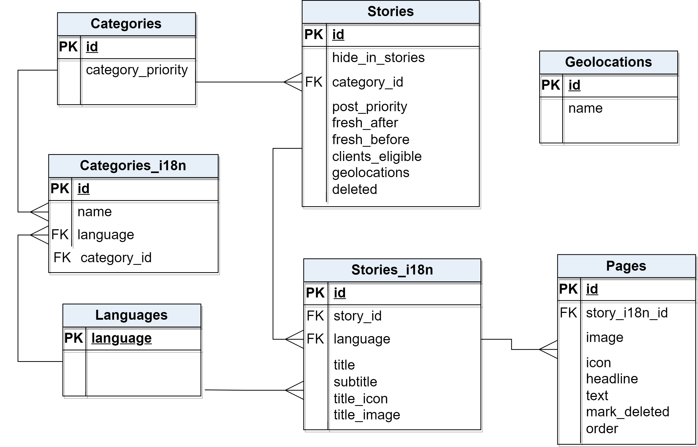
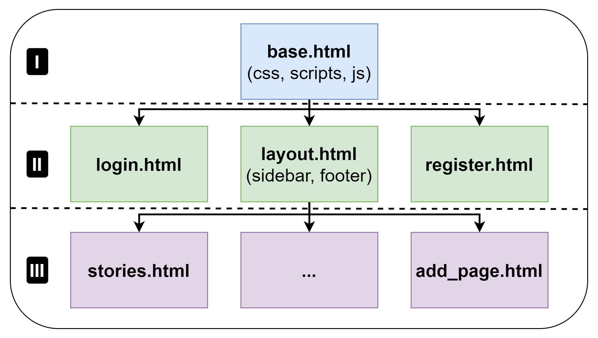
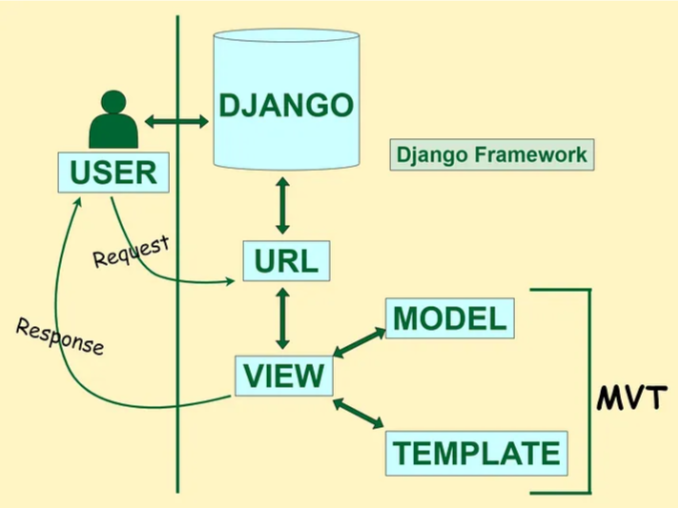

## Statring

* Clone the project `https://kathleen.tu-ilmenau.de:7443/scm/fs/flora-stories-editor.git`

* In `flora-stories-editor` folder, run command `docker-compose up -d --build` in the terminal.

## Information
All uploaded images keep in `stories_flora/media`.

`docker-compose.yml` keeps the information about the database namely the name, login and password of the database. Tha same data must be in settings of django in `stories_flora/stories_flora/settings.py`.

Dockerfile run the initial command file `stories_flora/start.sh`, which keeps several important django commands:
- `python manage.py migrate` creates tables and relationships between them from `stories_flora/main_app/models.py` in the database.
- `python manage.py createsuperuser_if_none_exists --user=admin --password=adminflora` creates the superuser and here we are able to change the login and password for the superuser. The superuser is required for the administrator panel. The file `stories_flora/main_app/management/commands/createsuperuser_if_none_exists.py` creates the superuser.
- `python manage.py loaddata initial_data_for_database.json` initializes the source data in the database. The json file is located in `stories_flora/main_app/fixtures/initial_data_for_database.json`.

## Users
The authorisation is required. It is not possible to operate with website without authorisation . 
There are three types of user:
- Admin: Only this user has the access to `Admin panel`. This user is only able to change the status of users. Admin can modify the data. There are no any restrictions; 
- Staff: This user can modify the data;
- Active: This is the default status when registering. This is type of user is allowed only to see the data and changes are prohibited.

Users: 
- Admin: login: admin, password: adminflora;
- Staff: login: test2 password: staffflora;
- Active: login: test3 password: activeflora.

## The structure of database

## The hierarchy of htmls

## Pattern MTV (Model Template View ) is applied
MTV is similar to MVC (Model View Controller): Model=Model, Template=View, View=Controller. 
MTV:
- Loosely coupled;
- Modifications are easy;
- Suitable both small and large applications;
- URL pattern mapping takes place.

